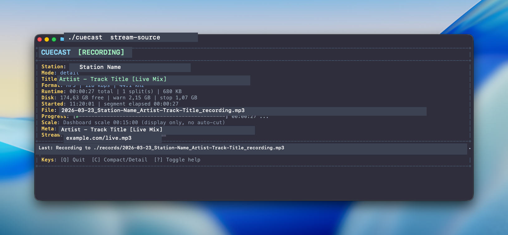

# Cuecast

Cuecast is a native macOS command line recorder for internet radio and long-form DJ streams. It saves the incoming audio exactly as received, splits files on metadata title changes, and keeps each finished segment usable in normal music players.

## Screenshot



Private stream details are redacted in the demo capture above.

## What It Does

- Records HTTP radio streams without transcoding.
- Requests and parses ICY metadata.
- Splits recordings when `StreamTitle` changes.
- Generates filesystem-safe filenames like `YYYY-MM-DD_Station-Name_Artist-Track-Title.mp3`.
- Preserves the original stream format such as MP3, AAC, or MP4.
- Writes a live terminal dashboard with title, codec, bitrate, sample rate, runtime, segment progress, and disk space.
- Gracefully stops on `Ctrl-C` or `q`, finalizing the current file and session manifest.
- Embeds ID3 tags into finalized MP3 segments by default.
- Can retag existing MP3 recordings later from a saved session manifest.

## Why It Exists

Most radio recorders focus on timers or full-stream dumps. Cuecast is built for continuous stations and DJ mixes where the stream metadata is the useful boundary. When the title changes, Cuecast rotates the file, updates the display, and keeps a structured log of what was recorded.

## Requirements

- macOS 13 or newer
- Swift 6 toolchain

## Build

```bash
swift build -c release
```

The repo-root `./cuecast` launcher builds the release binary on first run and rebuilds it when sources change.

## Usage

```bash
./cuecast --help
./cuecast "https://example.com/stream.pls"
./cuecast "https://example.com/live.mp3" --records-dir ./records
./cuecast --no-embed-tags "https://example.com/live.mp3"
./cuecast retag ./records
./cuecast retag ./records/2026-03-23_Station-Name_session-manifest.jsonl

swift run cuecast --help
swift run cuecast "https://example.com/stream.pls"
```

## Recording Behavior

- Common playlist URLs such as `.pls`, `.m3u`, `.m3u8`, and `.asx` are resolved before recording.
- If a stream exposes ICY metadata, title changes create new segment files.
- If a stream has no metadata, Cuecast records a single live file.
- The terminal dashboard supports hotkeys on an interactive TTY:
  - `q` for graceful quit
  - `c` to toggle compact/detail mode
  - `h` or `?` to show or hide the hotkey footer

## Output

Cuecast writes to `./records` by default.

You will typically see:

- audio segment files in the original stream format
- one `_session-manifest.jsonl` file per recording session

Filename states:

- `..._recording.mp3` for the active in-progress segment
- `...Track.mp3` for a segment that ended cleanly on a metadata boundary
- `..._partial.mp3` for the last segment when recording stops mid-title

The JSONL session manifest stores one JSON object per segment, including:

- source URL
- resolved stream URL
- station metadata
- codec, bitrate, sample rate, and content type
- file name
- title
- segment start and end timestamps
- raw metadata fields

## MP3 Metadata

Finalized MP3 segments are tagged by default so they work better in normal music players.

Cuecast currently writes:

- title
- artist when the stream title can be split reliably
- album or station name
- genre when available
- station website URL
- a recording comment
- best-effort artwork when a supported source exposes station artwork

If you want untouched MP3 files, use `--no-embed-tags`.

You can also backfill tags later:

```bash
./cuecast retag ./records
./cuecast retag <manifest.jsonl>
./cuecast retag <file.mp3> --manifest <manifest.jsonl>
```

## Safety Features

- Checks free disk space before recording starts.
- Shows remaining disk space in the dashboard.
- Warns before the disk is close to full.
- Stops early instead of writing until the volume is exhausted.
- Gracefully finalizes files and restores terminal state on normal shutdown.

## Notes

- The progress bar is visual only. It does not force time-based cuts.
- Splits happen only on metadata title changes.
- The terminal UI is designed for interactive ANSI-capable terminals and looks best in 256-color or truecolor environments.
- Artwork lookup is best-effort and source-dependent.

## License

MIT. See [LICENSE](LICENSE).

## Development

GitHub automation for this repository includes:

- CI on pushes and pull requests
- weekly Dependabot checks for Swift dependencies and GitHub Actions
- security policy documentation in [SECURITY.md](SECURITY.md)
